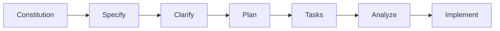

# Spec-Kit-Plus Mastery Guide for Production AI Systems

## 🎯 What You'll Master

By the end of this guide, you'll be able to:
- Build production-grade multi-agent AI systems using Spec-driven Vibe-coding
- Deploy scalable agentic applications with Kubernetes, Dapr, and Ray
- Master OpenAI Agents SDK, MCP, and A2A patterns
- Track architecture decisions (ADR) and prompt history (PHR) as first-class artifacts
- Create distributed AI systems with FastAPI, Next.js, and cloud-native infrastructure
- Use spec-kit-plus to ship production-ready AI applications faster

---

## 📚 Part 1: Core Concepts

### What is Spec-driven Vibe-coding?

**The Revolutionary Approach:**

spec-kit-plus introduces "Spec-driven Vibe-coding" - combining the rapid, conversational power of "vibe coding" with the structure and architectural coherence of spec-driven methodology.

**Traditional Vibe-Coding:**
```
Quick prompts → Fast code generation → Hope it works → Fix later → Repeat
```

**Pure Spec-Driven:**
```
Detailed specs → Structured planning → Systematic implementation → Slower but rigorous
```

**Spec-driven Vibe-coding (Best of Both):**
```
Conversational generation + Structured governance = Fast + Production-ready
```

### The Paradigm Shift

| Traditional | Vibe-Coding | Spec-driven Vibe-coding |
|------------|-------------|-------------------------|
| Manual everything | AI generates fast | AI generates with structure |
| Slow, predictable | Fast, chaotic | Fast, coherent |
| Hard to scale | Hard to maintain | Production-ready |
| Documentation after | No documentation | Documentation first-class |

### Why This Matters for Production AI

When building enterprise multi-agent systems, you need:
1. **Speed** - Rapid iteration with AI assistance
2. **Structure** - Architectural coherence for scale
3. **Traceability** - ADR and PHR tracking
4. **Governance** - Constitution-driven decisions
5. **Cloud-native** - Kubernetes, Dapr, Ray patterns

spec-kit-plus provides all of this.

### Key Philosophy: If AI Writes Code, What's Left?

**Your New Role as AI Engineer:**
- 🎯 **Strategic Problem-Solving** - Deconstructing complex challenges
- 🏗️ **System Architecture** - Designing resilient distributed systems
- 🔍 **Incisive Diagnostics** - Root cause analysis
- ❓ **Critical Inquiry** - Asking the right questions
- ⚖️ **Technical Governance** - Establishing standards

**The Future**: Growing up with AI as a collaborative partner, building intuition that traditional programmers lack.

---

## 🛠️ Part 2: Installation & Setup

### Prerequisites Check

```bash
# 1. Python 3.11+ (REQUIRED)
python --version

# 2. uv for package management (RECOMMENDED)
curl -LsSf https://astral.sh/uv/install.sh | sh

# 3. Git
git --version

# 4. Docker (for Kubernetes, Dapr)
docker --version

# 5. AI Coding Agent
# Claude Code, Cursor, Windsurf, Qwen, etc.
```

### Installation Methods

#### Method 1: PyPI Installation (Recommended - Easiest)

```bash
# Install from PyPI
pip install specifyplus

# Verify installation
sp check

# Later, to upgrade:
pip install -U specifyplus
```

#### Method 2: UV Tools (Recommended - Best Practice)

```bash
# Install with uv tools
uv tool install specifyplus

# Verify
sp check

# Upgrade later
uv tool upgrade specifyplus

# List all tools
uv tool list

# Uninstall if needed
uv tool uninstall specifyplus
```

#### Method 3: Direct Execution (No Installation)

```bash
# Run without installing
uvx specifyplus init my-project
# or shorter
uvx sp init my-project
```

**Benefits of UV Tools:**
- Tool stays in PATH
- Better management
- No shell aliases needed
- Clean configuration

---

## 🚀 Part 3: Your First Production AI Project

### Step 1: Initialize Project

```bash
# Basic initialization
sp init my-ai-agent-system

# With specific AI agent (Claude Code recommended)
sp init my-ai-agent-system --ai claude

# Initialize in current directory
sp init . --ai claude
# or
sp init --here --ai claude

# Force merge into non-empty directory
sp init . --force --ai claude

# Skip git initialization
sp init my-ai-agent-system --ai claude --no-git

# With debug output
sp init my-ai-agent-system --ai claude --debug

# For corporate environments
sp init my-ai-agent-system --ai claude --github-token ghp_your_token
```

### Step 2: Launch Your AI Agent

```bash
cd my-ai-agent-system

# If using Claude Code
claude
```

### Step 3: Verify Setup

You should see these slash commands (note: simpler than original spec-kit):
- `/constitution`
- `/specify`
- `/clarify`
- `/plan`
- `/tasks`
- `/analyze`
- `/implement`

---

## 📋 Part 4: The Spec-driven Vibe-coding Workflow

### The Enhanced 7-Step Process



### Step 1: Constitution - Project Governance

**Purpose:** Define principles for production AI systems

**Command:**
```
/constitution Create production-grade governance for multi-agent AI system
```

**Example for Production AI:**
```
/constitution Create principles for a scalable multi-agent AI system:

ARCHITECTURE PRINCIPLES:
- Cloud-Native First: Kubernetes for orchestration, Dapr for actor model
- Distributed by Design: Ray for compute, Redis for state
- Event-Driven: Message queues for agent communication
- Resilient: Circuit breakers, retries, fallbacks
- Observable: Structured logging, OpenTelemetry tracing

AGENT DESIGN:
- Single Responsibility: Each agent has one clear purpose
- Composability: Agents communicate via standardized protocols
- MCP Integration: Use Model Context Protocol for tool access
- A2A Communication: Agent-to-Agent with typed messages
- Stateless Execution: State in Redis, compute ephemeral

CODE QUALITY:
- Python: Type hints everywhere, Pydantic v2 schemas
- TypeScript: Strict mode, no implicit any
- Testing: 85% coverage, integration tests for all workflows
- Documentation: ADR for architecture, PHR for prompts

AI/LLM STANDARDS:
- OpenAI Agents SDK for agent orchestration
- Streaming responses with Server-Sent Events
- Token tracking per agent and user
- Retry logic: 3 attempts, exponential backoff
- Fallback models: GPT-4 → GPT-3.5 → Claude

DEPLOYMENT:
- Docker containers for all services
- Kubernetes manifests with Helm charts
- Dapr sidecars for actor model and pub/sub
- Ray clusters for distributed compute
- Redis for caching and state management

SECURITY:
- Zero-trust architecture
- JWT authentication with short expiry
- API keys encrypted at rest
- Rate limiting per tenant
- Audit logs for all agent actions

PERFORMANCE:
- Agent response: <3s (p95)
- Horizontal scaling: 100+ concurrent users
- Async processing for long-running tasks
- Connection pooling for databases
- CDN for static assets
```

**Output:** `.specify/memory/constitution.md`

### Step 2: Specify - Define Requirements

**Purpose:** Describe WHAT you want (not HOW)

**Command:**
```
/specify [Your requirements]
```

**Example for Multi-Agent RAG System:**
```
/specify Build AgentFlow - A production multi-agent RAG platform

OVERVIEW:
AgentFlow is an enterprise RAG system with a sophisticated multi-agent architecture. It processes documents, answers questions, and provides intelligent responses with citations. Built for scale with Kubernetes, Dapr, and Ray.

CORE ARCHITECTURE:

Multi-Agent Pipeline:
1. Ingestion Agent (Dapr Actor)
   - Receives document upload events via pub/sub
   - Extracts text using Ray workers
   - Chunks content semantically
   - Generates embeddings in parallel
   - Stores in vector database
   - Publishes completion events

2. Orchestrator Agent (Dapr Workflow)
   - Receives user queries
   - Coordinates sub-agents via A2A protocol
   - Manages conversation context
   - Handles failures and retries
   - Returns structured responses

3. Retrieval Agent (OpenAI Agent with MCP)
   - Semantic search across vector DB
   - Reranking with cross-encoder
   - Metadata filtering
   - Hybrid search (vector + keyword)
   - Returns top-k chunks with scores

4. Synthesis Agent (OpenAI Agent with streaming)
   - Receives query + retrieved chunks
   - Generates comprehensive answer
   - Streams response tokens via SSE
   - Ensures grounding in context
   - Adds confidence scores

5. Citation Agent (OpenAI Agent)
   - Analyzes synthesis output
   - Identifies source documents
   - Creates clickable citations
   - Highlights relevant passages
   - Formats for UI display

6. Monitoring Agent (Background Worker)
   - Tracks token usage per agent
   - Monitors response times
   - Detects anomalies
   - Triggers alerts
   - Generates reports

FEATURES:

Document Management:
- Upload PDFs up to 100MB via drag-drop
- Batch processing with Ray workers
- Real-time progress via WebSocket
- Status tracking: pending → processing → ready → failed
- Support 1000+ documents per tenant
- Automatic retry on failure
- S3 storage with presigned URLs

Intelligent Querying:
- Natural language questions
- Real-time agent activity visualization
- Streaming responses character-by-character
- Confidence scores per answer
- Related questions suggestions
- Query refinement with follow-ups
- Context-aware conversations

Citations & Sources:
- Clickable citations: [Doc Name, Page X]
- Highlight relevant text in source
- Jump to exact page in document
- View full context around citation
- Download source documents
- Share citations with team

Multi-Tenancy:
- Isolated data per organization
- Separate vector namespaces
- Tenant-specific rate limits
- Usage tracking per tenant
- Custom embedding models per tenant

Admin Dashboard:
- Real-time agent metrics
- Token usage breakdown
- Cost analysis (per agent, per tenant)
- Performance graphs (response times)
- Error logs and debugging
- Agent health monitoring

USER STORIES:

Story 1: Enterprise Document Upload
As a user, I upload a 50-page technical manual
- System accepts PDF via drag-drop
- Ray workers process in parallel (30s total)
- Real-time progress: "Extracting pages 1-50...", "Generating embeddings..."
- Document appears in library with preview
- Status: Ready for queries

Story 2: Multi-Agent Query Processing
As a user, I ask "What are the safety procedures?"
- Query sent to Orchestrator Agent
- Orchestrator invokes Retrieval Agent via A2A
- Retrieval searches vector DB, returns 5 chunks
- Orchestrator invokes Synthesis Agent with chunks
- Synthesis streams answer in real-time
- Citation Agent adds formatted citations
- User sees answer + clickable sources in <5s

Story 3: Agent Coordination Failure
As a system, when Synthesis Agent fails:
- Orchestrator detects timeout (5s)
- Automatically retries with exponential backoff
- On 3rd failure, falls back to GPT-3.5
- Logs error with trace ID
- Returns partial answer with warning
- Monitoring Agent triggers alert

Story 4: Horizontal Scaling
As infrastructure, when load increases to 100 concurrent users:
- Kubernetes scales pods automatically
- Dapr sidecars maintain agent state
- Ray cluster scales workers
- Redis handles increased connections
- Response times remain <3s (p95)
- No service degradation

Story 5: Token Cost Optimization
As an admin, I view token usage dashboard:
- See breakdown: Retrieval (10%), Synthesis (70%), Citation (20%)
- Identify high-cost queries
- Adjust parameters: reduce chunk size for retrieval
- Switch synthesis to GPT-3.5 for simple queries
- Save 40% on costs while maintaining quality

CONSTRAINTS:
- Support 500 concurrent users
- Process 100 documents simultaneously
- Query response: <3s (95th percentile)
- 10,000 documents per tenant maximum
- 99.9% uptime SLA
- GDPR compliant data handling
- SOC 2 Type II certification ready

ACCEPTANCE CRITERIA:
- User uploads PDF, sees completion in <2min for 50-page doc
- User asks question, receives streaming answer with citations in <3s
- System handles 500 concurrent queries without degradation
- Failed agent calls retry automatically
- Admin sees real-time metrics dashboard
- All agent decisions logged with trace IDs
- System recovers from Redis/DB failures
- Kubernetes scales pods based on load
```

**Output:** `.specify/specs/001-agentflow/spec.md`

### Step 3: Clarify - Structured Q&A

**Purpose:** Fill knowledge gaps before planning

**Command:**
```
/clarify
```

**What Happens:**
Agent asks targeted questions. Answer them thoroughly:

**Example Q&A:**

**Q:** Which vector database: Pinecone, Weaviate, or pgvector?  
**A:** Use Qdrant for production. Self-hosted in Kubernetes, supports multi-tenancy, has efficient filtering, and scales horizontally.

**Q:** OpenAI Agents SDK version and streaming approach?  
**A:** Use latest OpenAI Agents SDK (1.x). Stream responses using Server-Sent Events (SSE). Implement token streaming with async generators in FastAPI.

**Q:** Dapr actor model vs. traditional microservices?  
**A:** Use Dapr actors for stateful agents (Ingestion, Orchestrator). Actors provide automatic state management, single-threaded execution guarantees, and built-in reminders. Use stateless services for Retrieval, Synthesis, Citation.

**Q:** Ray deployment strategy?  
**A:** Deploy Ray cluster in Kubernetes using KubeRay operator. Use Ray workers for compute-intensive tasks (PDF extraction, embedding generation). Auto-scale based on queue depth.

**Q:** MCP tools integration?  
**A:** Retrieval Agent uses MCP to access: vector_search, keyword_search, metadata_filter, rerank. Tools defined in MCP protocol format, registered with OpenAI Agents SDK.

**Q:** A2A message format?  
**A:** Use Pydantic schemas for all agent messages:
```python
class RetrievalRequest(BaseModel):
    query: str
    top_k: int = 5
    filters: Dict[str, Any] = {}
    trace_id: str

class RetrievalResponse(BaseModel):
    chunks: List[Chunk]
    scores: List[float]
    duration_ms: int
    trace_id: str
```

**After answering, validate:**
```
Read the review and acceptance checklist, and check off each item in the checklist if the feature spec meets the criteria. Leave it empty if it does not.
```

### Step 4: Plan - Technical Architecture

**Purpose:** Define HOW to build with production stack

**Command:**
```
/plan [Your tech stack and architecture]
```

**Example for Production AI System:**
```
/plan Technical Architecture for Production Multi-Agent System

INFRASTRUCTURE STACK:

1. Container Orchestration (Kubernetes 1.28+)
   - Namespaces per environment (dev, staging, prod)
   - Resource quotas and limits
   - Horizontal Pod Autoscaling (HPA) for all services
   - Network policies for security
   - Ingress with TLS termination

2. Service Mesh & Actors (Dapr 1.12+)
   - State management with Redis
   - Pub/sub with Redis Streams
   - Actor model for stateful agents
   - Service invocation with mTLS
   - Observability with OpenTelemetry

3. Distributed Compute (Ray 2.9+)
   - Ray cluster with KubeRay operator
   - Worker pools for CPU/GPU tasks
   - Auto-scaling based on queue depth
   - Shared object store with Plasma
   - Task scheduling and dependencies

4. Vector Database (Qdrant 1.7+)
   - Deployed in Kubernetes StatefulSet
   - Persistent volumes for data
   - Multi-tenant collections
   - HNSW indexing for speed
   - Backup to S3 nightly

5. Cache & State (Redis 7.2+)
   - Redis Cluster for HA
   - Separate instances for:
     * Dapr state store
     * Celery broker
     * Application cache
   - Persistence with AOF

BACKEND ARCHITECTURE:

1. API Gateway (FastAPI 0.115+)
   
   Endpoints:
   - POST /v1/documents - Upload with presigned S3 URLs
   - GET /v1/documents/{id} - Document details
   - POST /v1/queries - Submit query to orchestrator
   - GET /v1/queries/stream - SSE for streaming
   - GET /v1/admin/metrics - Prometheus metrics
   
   Structure:
   ```
   api/
   ├── main.py              # FastAPI app with lifespan
   ├── routers/
   │   ├── documents.py     # Document endpoints
   │   ├── queries.py       # Query endpoints
   │   └── admin.py         # Admin endpoints
   ├── middleware/
   │   ├── auth.py          # JWT validation
   │   ├── rate_limit.py    # Per-tenant limits
   │   └── tracing.py       # OpenTelemetry
   ├── dependencies.py      # DI for services
   └── config.py            # Pydantic settings
   ```

2. Ingestion Agent (Dapr Actor)
   
   Implementation:
   ```python
   from dapr.actor import Actor, Remindable
   from openai import AsyncOpenAI
   
   class IngestionActor(Actor, Remindable):
       def __init__(self, ctx, actor_id):
           super().__init__(ctx, actor_id)
           self.state_key = f"ingestion_{actor_id}"
       
       async def process_document(self, doc_id: str):
           # Load state from Dapr
           state = await self.state_manager.try_get_state(self.state_key)
           
           # Submit to Ray for extraction
           pdf_text = ray.get(extract_pdf.remote(doc_id))
           
           # Chunk semantically
           chunks = ray.get(semantic_chunk.remote(pdf_text))
           
           # Generate embeddings in parallel
           embeddings = ray.get([
               generate_embedding.remote(chunk)
               for chunk in chunks
           ])
           
           # Store in Qdrant
           await qdrant_client.upsert(
               collection=f"tenant_{tenant_id}",
               points=[
                   {"id": i, "vector": emb, "payload": chunk_meta}
                   for i, (emb, chunk_meta) in enumerate(zip(embeddings, chunks))
               ]
           )
           
           # Update state
           await self.state_manager.set_state(
               self.state_key,
               {"status": "completed", "chunks": len(chunks)}
           )
           
           # Publish completion event
           await dapr_client.publish_event(
               "ingestion-events",
               "document.completed",
               {"doc_id": doc_id}
           )
   ```

3. Orchestrator Agent (Dapr Workflow)
   
   Implementation:
   ```python
   from dapr.ext.workflow import WorkflowRuntime, WorkflowActivityContext
   from dapr.clients import DaprClient
   
   async def orchestrate_query_workflow(ctx: WorkflowActivityContext, input):
       query = input["query"]
       trace_id = input["trace_id"]
       
       try:
           # Step 1: Retrieve (with retry)
           retrieval_result = await ctx.call_activity(
               retrieve_chunks,
               input={"query": query, "top_k": 5, "trace_id": trace_id},
               retry_policy=WorkflowRetryPolicy(max_attempts=3)
           )
           
           # Step 2: Synthesize (with streaming)
           synthesis_result = await ctx.call_activity(
               synthesize_answer,
               input={
                   "query": query,
                   "chunks": retrieval_result["chunks"],
                   "trace_id": trace_id
               }
           )
           
           # Step 3: Extract citations
           citation_result = await ctx.call_activity(
               extract_citations,
               input={
                   "answer": synthesis_result["answer"],
                   "chunks": retrieval_result["chunks"],
                   "trace_id": trace_id
               }
           )
           
           return {
               "answer": synthesis_result["answer"],
               "citations": citation_result["citations"],
               "trace_id": trace_id
           }
           
       except Exception as e:
           # Log with trace ID
           logger.error(f"Workflow failed: {e}", extra={"trace_id": trace_id})
           # Fallback to simple search
           return await ctx.call_activity(fallback_search, input)
   ```

4. Retrieval Agent (OpenAI Agent + MCP)
   
   MCP Tools Definition:
   ```python
   from mcp import Tool, ToolParameter
   from openai import AsyncOpenAI
   
   vector_search_tool = Tool(
       name="vector_search",
       description="Semantic search across document collection",
       parameters=[
           ToolParameter(name="query", type="string", required=True),
           ToolParameter(name="top_k", type="integer", default=5),
           ToolParameter(name="filters", type="object", default={})
       ]
   )
   
   async def vector_search(query: str, top_k: int, filters: dict):
       results = await qdrant_client.search(
           collection_name=f"tenant_{get_tenant_id()}",
           query_vector=await get_embedding(query),
           limit=top_k,
           query_filter=filters
       )
       return [
           {
               "content": r.payload["text"],
               "score": r.score,
               "metadata": r.payload["metadata"]
           }
           for r in results
       ]
   
   # Register with OpenAI Agents SDK
   retrieval_agent = Agent(
       name="retrieval",
       tools=[vector_search_tool],
       model="gpt-4-turbo"
   )
   ```

5. Synthesis Agent (Streaming with SSE)
   
   Implementation:
   ```python
   from openai import AsyncOpenAI
   from fastapi.responses import StreamingResponse
   
   async def synthesize_streaming(query: str, chunks: List[str], trace_id: str):
       client = AsyncOpenAI()
       
       system_prompt = f"""You are a synthesis agent. Answer the question based ONLY on the provided context.
       
       Context:
       {chr(10).join(f"[{i}] {chunk}" for i, chunk in enumerate(chunks))}
       
       Question: {query}
       
       Provide a comprehensive answer with references to context chunks [0], [1], etc.
       """
       
       stream = await client.chat.completions.create(
           model="gpt-4-turbo",
           messages=[{"role": "user", "content": system_prompt}],
           stream=True,
           temperature=0.2
       )
       
       async def generate():
           async for chunk in stream:
               if chunk.choices[0].delta.content:
                   token = chunk.choices[0].delta.content
                   # Send as SSE
                   yield f"data: {json.dumps({'token': token, 'trace_id': trace_id})}

"
           yield "data: [DONE]

"
       
       return StreamingResponse(generate(), media_type="text/event-stream")
   ```

FRONTEND ARCHITECTURE:

1. Framework (Next.js 14 App Router)
   
   Structure:
   ```
   app/
   ├── (auth)/
   │   ├── login/page.tsx
   │   └── register/page.tsx
   ├── (dashboard)/
   │   ├── layout.tsx         # Shared layout with sidebar
   │   ├── documents/page.tsx
   │   ├── query/page.tsx
   │   └── history/page.tsx
   ├── admin/
   │   └── metrics/page.tsx
   ├── api/
   │   ├── auth/[...nextauth]/route.ts
   │   └── upload/route.ts
   └── middleware.ts          # Auth + rate limiting
   ```

2. State Management
   - TanStack Query for server state
   - Zustand for client state (user, UI)
   - React Context for theme
   - SSE for real-time updates

3. Components (shadcn/ui + Custom)
   - DocumentUploader (react-dropzone + S3 presigned)
   - AgentActivityPanel (real-time agent status)
   - StreamingAnswer (SSE consumer, word-by-word)
   - CitationViewer (PDF.js for inline viewing)
   - MetricsDashboard (Recharts for graphs)

DEPLOYMENT:

1. Docker Images
   ```dockerfile
   # api/Dockerfile
   FROM python:3.11-slim
   WORKDIR /app
   COPY requirements.txt .
   RUN pip install --no-cache-dir -r requirements.txt
   COPY . .
   CMD ["uvicorn", "main:app", "--host", "0.0.0.0", "--port", "8000"]
   ```

2. Kubernetes Manifests (Helm)
   ```yaml
   # helm/templates/api-deployment.yaml
   apiVersion: apps/v1
   kind: Deployment
   metadata:
     name: api
   spec:
     replicas: 3
     template:
       metadata:
         annotations:
           dapr.io/enabled: "true"
           dapr.io/app-id: "api"
           dapr.io/app-port: "8000"
       spec:
         containers:
         - name: api
           image: agentflow/api:latest
           resources:
             requests:
               memory: "512Mi"
               cpu: "500m"
             limits:
               memory: "1Gi"
               cpu: "1000m"
           env:
           - name: REDIS_URL
             valueFrom:
               secretKeyRef:
                 name: redis-secret
                 key: url
   ```

3. CI/CD (GitHub Actions)
   ```yaml
   # .github/workflows/deploy.yml
   name: Deploy to Kubernetes
   on:
     push:
       branches: [main]
   jobs:
     deploy:
       runs-on: ubuntu-latest
       steps:
       - uses: actions/checkout@v3
       - name: Build and push
         run: |
           docker build -t agentflow/api:${{ github.sha }} .
           docker push agentflow/api:${{ github.sha }}
       - name: Deploy to k8s
         run: |
           helm upgrade --install agentflow ./helm \
             --set image.tag=${{ github.sha }}
   ```

OBSERVABILITY:

1. Logging (Structured with structlog)
   ```python
   import structlog
   
   logger = structlog.get_logger()
   logger.info(
       "agent.retrieval.completed",
       trace_id=trace_id,
       chunks_found=len(chunks),
       duration_ms=duration
   )
   ```

2. Tracing (OpenTelemetry)
   - Automatic traces for FastAPI
   - Manual spans for agent calls
   - Propagate trace context via headers
   - Export to Jaeger

3. Metrics (Prometheus)
   - Request duration histograms
   - Token usage counters
   - Agent invocation rates
   - Error rates per agent

TESTING STRATEGY:

1. Unit Tests (pytest)
   - Agent logic with mocked LLM calls
   - Pydantic model validation
   - Utility functions

2. Integration Tests
   - API endpoints with TestClient
   - Dapr actor methods with test sidecars
   - Ray task execution
   - Database operations

3. E2E Tests (pytest-playwright)
   - Full document upload → query flow
   - Multi-agent coordination
   - Failure recovery
   - Load testing with Locust

ADR & PHR TRACKING:

1. Architecture Decision Records
   ```markdown
   # ADR-001: Use Dapr for Actor Model
   
   ## Context
   Need stateful agents with guaranteed single-threaded execution
   
   ## Decision
   Use Dapr actors for Ingestion and Orchestrator agents
   
   ## Consequences
   - Automatic state management
   - Built-in reminders
   - Requires Dapr sidecar (adds ~50MB memory)
   - Easier to test with Dapr testcontainers
   ```

2. Prompt History Records
   ```markdown
   # PHR-001: Synthesis Agent System Prompt
   
   ## Version: 1.0
   ## Date: 2024-12-03
   
   ## Prompt
   You are a synthesis agent...
   
   ## Performance
   - Accuracy: 92%
   - Avg tokens: 350
   - Latency: 1.2s (p95)
   
   ## Changes from Previous
   - Added "ONLY use provided context" constraint
   - Reduced temperature from 0.5 to 0.2
   ```
```

**Output Files:**
- `.specify/specs/001-agentflow/plan.md`
- `.specify/specs/001-agentflow/data-model.md`
- `.specify/specs/001-agentflow/research.md`
- `.specify/specs/001-agentflow/contracts/api-spec.json`
- `.specify/specs/001-agentflow/architecture/adr-*.md`
- `.specify/specs/001-agentflow/prompts/phr-*.md`

**Research & Audit:**
```
Research the latest:
1. OpenAI Agents SDK streaming best practices
2. Dapr actor state management patterns
3. KubeRay auto-scaling configuration
4. Qdrant multi-tenancy implementation
5. MCP tools integration with OpenAI

Then audit the plan for:
- Over-engineering
- Missing error handling
- Security gaps
- Performance bottlenecks
```

### Step 5: Tasks - Executable Breakdown

**Purpose:** Generate ordered, parallelizable tasks

**Command:**
```
/tasks
```

**Output:** `.specify/specs/001-agentflow/tasks.md`

**Example Structure:**
```markdown
## Phase 1: Infrastructure Setup

1. [Sequential] Create Kubernetes namespace and resource quotas
2. [Sequential] Deploy Redis cluster with Helm
3. [P] Deploy Dapr with state store configuration
4. [P] Deploy Ray cluster with KubeRay operator
5. [P] Deploy Qdrant StatefulSet
6. [Sequential] Configure Ingress with TLS

## Phase 2: Backend - Core Models (Story Foundation)

7. [Sequential] Create Pydantic schemas in app/schemas/
8. [Sequential] Create SQLModel database models
9. [P] Write unit tests for all schemas
10. [P] Create Alembic migrations

## Phase 3: Ingestion Agent (Story 1)

11. [Sequential] Implement IngestionActor with Dapr
12. [P] Create Ray task for PDF extraction
13. [P] Create Ray task for semantic chunking
14. [P] Create Ray task for embedding generation
15. [Sequential] Implement Qdrant upsert logic
16. [P] Write integration tests for ingestion flow

... (continues for all features)
```

### Step 6: Analyze - Cross-Artifact Validation

**Purpose:** Ensure consistency across specs, plan, and tasks

**Command:**
```
/analyze
```

**What It Checks:**
- Requirements in spec are covered in tasks
- Architecture decisions in plan match implementation
- No missing dependencies between tasks
- All agents defined in spec have implementations
- ADRs are referenced in plan
- PHRs exist for all agent prompts

**Output:** Analysis report with findings and recommendations

### Step 7: Implement - Systematic Execution

**Purpose:** AI agent executes all tasks

**Command:**
```
/implement
```

**What Happens:**
- Validates all prerequisites
- Executes tasks in dependency order
- Handles parallel tasks
- Runs tests as defined
- Logs progress with trace IDs
- Handles errors gracefully

**Monitor:**
```
✓ Task 1/87: Created Kubernetes namespace
✓ Task 2/87: Deployed Redis cluster
✓ Task 3/87: Configured Dapr state store
✓ Task 4/87: Deployed Ray cluster
...
```

---

## 🎨 Part 5: Advanced Production Patterns

### Pattern 1: OpenAI Agents SDK with MCP

```python
# Define MCP tools
from mcp import MCPClient, Tool

# Create retrieval agent with MCP tools
retrieval_agent = Agent(
    name="retrieval",
    model="gpt-4-turbo",
    tools=[
        Tool(
            name="vector_search",
            description="Search documents semantically",
            function=vector_search_function
        ),
        Tool(
            name="keyword_search", 
            description="Search documents with keywords",
            function=keyword_search_function
        )
    ]
)

# Execute with streaming
async for event in retrieval_agent.run_stream(
    messages=[{"role": "user", "content": query}]
):
    if event.type == "tool_call":
        print(f"Calling tool: {event.tool_name}")
    elif event.type == "completion":
        print(f"Result: {event.content}")
```

### Pattern 2: Dapr Actors for Stateful Agents

```python
from dapr.actor import Actor, ActorInterface, ActorMethod

class IIngestionAgent(ActorInterface):
    @ActorMethod(name="ProcessDocument")
    async def process_document(self, doc_id: str) -> dict:
        pass

class IngestionAgent(Actor, IIngestionAgent):
    async def process_document(self, doc_id: str) -> dict:
        # State automatically managed by Dapr
        state = await self.state_manager.get_state("status")
        
        # Your agent logic
        result = await self._process(doc_id)
        
        # Update state
        await self.state_manager.set_state("status", "completed")
        await self.state_manager.save_state()
        
        return result
```

### Pattern 3: Ray for Distributed Compute

```python
import ray

@ray.remote
def extract_pdf(pdf_path: str) -> str:
    # CPU-intensive PDF extraction
    return extracted_text

@ray.remote(num_gpus=1)
def generate_embeddings(texts: List[str]) -> List[List[float]]:
    # GPU-accelerated embedding generation
    return embeddings

# Execute in parallel
futures = [extract_pdf.remote(pdf) for pdf in pdfs]
texts = ray.get(futures)

# Then generate embeddings
embedding_futures = [
    generate_embeddings.remote(batch)
    for batch in batch_texts(texts, batch_size=32)
]
embeddings = ray.get(embedding_futures)
```

### Pattern 4: A2A (Agent-to-Agent) Communication

```python
from pydantic import BaseModel
from dapr.clients import DaprClient

class AgentMessage(BaseModel):
    from_agent: str
    to_agent: str
    message_type: str
    payload: dict
    trace_id: str

async def send_to_agent(message: AgentMessage):
    async with DaprClient() as client:
        await client.invoke_method(
            app_id=message.to_agent,
            method_name="process",
            data=message.json()
        )

# Orchestrator sends to Retrieval Agent
await send_to_agent(AgentMessage(
    from_agent="orchestrator",
    to_agent="retrieval",
    message_type="search_request",
    payload={"query": query, "top_k": 5},
    trace_id=trace_id
))
```

### Pattern 5: Kubernetes Deployment with HPA

```yaml
apiVersion: apps/v1
kind: Deployment
metadata:
  name: synthesis-agent
spec:
  replicas: 3
  template:
    metadata:
      annotations:
        dapr.io/enabled: "true"
        dapr.io/app-id: "synthesis"
    spec:
      containers:
      - name: agent
        image: agentflow/synthesis:latest
        resources:
          requests:
            memory: "1Gi"
            cpu: "500m"
          limits:
            memory: "2Gi"
            cpu: "1000m"
---
apiVersion: autoscaling/v2
kind: HorizontalPodAutoscaler
metadata:
  name: synthesis-agent-hpa
spec:
  scaleTargetRef:
    apiVersion: apps/v1
    kind: Deployment
    name: synthesis-agent
  minReplicas: 3
  maxReplicas: 10
  metrics:
  - type: Resource
    resource:
      name: cpu
      target:
        type: Utilization
        averageUtilization: 70
```

---

## 🧩 Part 6: Integration Examples

### With OpenAI Agents SDK

```bash
# Constitution
/constitution For OpenAI Agents SDK production system:
- Use Assistant API with vector stores
- Streaming with async generators
- Function calling for all tools
- Structured outputs with Pydantic
- Token tracking per conversation
- Rate limiting per user

# Specify
/specify Build customer support automation with OpenAI Agents SDK:
- Classifier Agent: Routes tickets
- Resolution Agent: Attempts to solve
- Escalation Agent: Hands off to human
- Use MCP for CRM integration
- Track conversation history
- Maintain thread per user
```

### With LangGraph State Machines

```bash
# Specify
/specify Build research workflow with LangGraph:
- Planning Agent: Creates research plan
- Search Agent: Gathers information
- Analysis Agent: Synthesizes findings
- Review Agent: Quality checks
- Use LangGraph for state management
- Checkpointing for resume
- Conditional edges based on confidence

# Plan
/plan LangGraph architecture:
- StateGraph with typed state
- MemorySaver for checkpointing
- Subgraphs for complex flows
- Deploy as FastAPI endpoint
- Kubernetes for scaling
- Redis for state persistence
```

### With CrewAI Multi-Agent

```bash
# Specify
/specify Build content creation crew with CrewAI:
- Researcher: Gathers facts and data
- Writer: Drafts initial content
- Editor: Reviews and improves
- SEO Specialist: Optimizes for search
- Agents collaborate sequentially
- Shared memory across crew
- Final output: publication-ready article

# Plan
/plan CrewAI deployment:
- Define roles, goals, backstories
- Sequential process for workflow
- Custom tools per agent
- Deploy as Dapr workflow
- Kubernetes pods per agent
- Monitoring with OpenTelemetry
```

### With n8n Workflow Orchestration

```bash
# Constitution
/constitution For n8n integration:
- All workflows triggered via webhook
- Return 202 immediately, process async
- Callback webhooks for results
- Store execution IDs
- Retry failed workflows
- Monitor with n8n API

# Specify
/specify Build document processing with n8n:
- User uploads via API
- API triggers n8n workflow
- n8n orchestrates: extract → validate → store
- n8n calls back with results
- Real-time status via WebSocket

# Plan
/plan n8n integration architecture:
- FastAPI webhook endpoints
- Celery for monitoring n8n status
- n8n workflows with error handling
- PostgreSQL for execution metadata
- Dapr pub/sub for event routing
```

---

## 📊 Part 7: ADR & PHR Tracking

### Architecture Decision Records (ADR)

**Purpose:** Document significant architectural decisions

**Structure:**
```markdown
# ADR-001: Choose Dapr Over Custom Service Mesh

## Status
Accepted

## Context
Need service-to-service communication with mTLS, state management, and pub/sub for multi-agent system.

## Decision
Use Dapr instead of custom service mesh or direct Redis/NATS integration.

## Consequences

### Positive
- Built-in state management with pluggable backends
- Actor model for stateful agents
- Automatic mTLS between services
- Observability with OpenTelemetry out-of-box
- Language-agnostic (Python, TypeScript, Go)

### Negative
- Additional sidecar per pod (~50MB memory)
- Learning curve for Dapr-specific patterns
- Dependency on Dapr project maintenance

## Alternatives Considered
- Custom gRPC with etcd for state: More complex, more code
- Direct Redis: No actor model, manual state management
- Kubernetes native: No built-in pub/sub or actors
```

**When to Create ADR:**
- Choosing between major frameworks (Dapr vs custom)
- Database selection (Qdrant vs Pinecone)
- Deployment strategy (Kubernetes vs serverless)
- Security architecture decisions
- Scaling approach (horizontal vs vertical)

### Prompt History Records (PHR)

**Purpose:** Track prompt evolution and performance

**Structure:**
```markdown
# PHR-003: Synthesis Agent System Prompt

## Metadata
- Version: 2.1
- Date: 2024-12-03
- Agent: synthesis
- Model: gpt-4-turbo

## Prompt
```
You are a synthesis agent in a multi-agent RAG system.

Your task: Generate a comprehensive, accurate answer to the user's question based ONLY on the provided context chunks.

Context Chunks:
{chunks}

User Question: {query}

Instructions:
1. Read all context chunks carefully
2. Synthesize information across chunks
3. Answer in 2-3 paragraphs
4. Reference chunks using [0], [1], etc.
5. If context insufficient, say "Based on the available information..."
6. Do NOT use external knowledge
7. Maintain neutral, informative tone

Answer:
```

## Performance Metrics
- Accuracy: 94% (up from 89% in v2.0)
- Avg response time: 1.8s (p95)
- Avg tokens: 380
- Grounding rate: 97% (answers use only provided context)
- User satisfaction: 4.6/5

## Changes from v2.0
- Added explicit "ONLY on provided context" constraint
- Changed from 3-5 paragraphs to 2-3 (reduced verbosity)
- Added "If context insufficient" fallback instruction
- Removed temperature parameter (now set in code)

## A/B Test Results
- v2.0 vs v2.1 over 1000 queries
- v2.1 had 5% higher grounding rate
- v2.1 responses 15% shorter (user feedback: more concise)
- No change in accuracy

## Next Steps
- Test with different chunk sizes
- Experiment with adding retrieval confidence scores to prompt
```

**When to Create PHR:**
- Initial prompt design
- Significant prompt changes
- Performance improvements/degradations
- Model upgrades
- A/B test results

---

## 🐛 Part 8: Troubleshooting

### Issue: sp Command Not Found

```bash
# Check installation
pip list | grep specifyplus

# Reinstall
pip install -U specifyplus

# Or with uv
uv tool install specifyplus --force

# Verify
sp check
```

### Issue: Slash Commands Not Appearing

```bash
# Check if CLAUDE.md or equivalent exists
ls -la .specify/

# Re-initialize
sp init . --force --ai claude

# Restart AI agent
claude
```

### Issue: Dapr Actor State Not Persisting

```yaml
# Check Redis configuration in dapr-config.yaml
apiVersion: dapr.io/v1alpha1
kind: Component
metadata:
  name: statestore
spec:
  type: state.redis
  metadata:
  - name: redisHost
    value: redis:6379
  - name: redisPassword
    secretKeyRef:
      name: redis-secret
      key: password
  - name: actorStateStore
    value: "true"
```

### Issue: Ray Tasks Not Distributing

```bash
# Check Ray cluster status
ray status

# Check worker nodes
kubectl get pods -l ray.io/node-type=worker

# Scale workers
kubectl scale deployment ray-worker --replicas=5

# Monitor task queue
ray monitor
```

### Issue: Kubernetes Pods OOMKilled

```yaml
# Increase memory limits
resources:
  requests:
    memory: "2Gi"
  limits:
    memory: "4Gi"

# Or enable HPA
kubectl autoscale deployment synthesis-agent \
  --cpu-percent=70 \
  --min=3 \
  --max=10
```

---

## 🎓 Part 9: Learning Path

### Week 1: Foundations
- [ ] Install spec-kit-plus with `pip install specifyplus`
- [ ] Initialize first project with `sp init`
- [ ] Complete simple API using spec-driven vibe-coding
- [ ] Master the 7-step workflow

### Week 2: Multi-Agent Basics
- [ ] Build RAG system with OpenAI Agents SDK
- [ ] Implement MCP tools for agents
- [ ] Add streaming responses with SSE
- [ ] Deploy locally with Docker Compose

### Week 3: Production Infrastructure
- [ ] Deploy to Kubernetes cluster
- [ ] Implement Dapr actors for stateful agents
- [ ] Set up Ray for distributed compute
- [ ] Configure observability (logs, traces, metrics)

### Week 4: Advanced Patterns
- [ ] Implement A2A communication
- [ ] Create ADRs for architecture decisions
- [ ] Track PHRs for prompt evolution
- [ ] Set up CI/CD pipeline
- [ ] Load test with 100+ concurrent users

---

## 🔗 Part 10: Quick Reference

### Essential Commands

```bash
# Installation
pip install specifyplus
# or
uv tool install specifyplus

# Initialize project
sp init my-project --ai claude

# Check setup
sp check

# Upgrade
pip install -U specifyplus
# or
uv tool upgrade specifyplus
```

### Slash Commands (Simpler than spec-kit!)

```
/constitution  # Project principles
/specify       # Define requirements
/clarify       # Fill knowledge gaps
/plan          # Technical architecture
/tasks         # Break into actionable tasks
/analyze       # Cross-artifact validation
/implement     # Execute implementation
```

### Key Differences from spec-kit

| Feature | spec-kit | spec-kit-plus |
|---------|----------|---------------|
| Install | GitHub URL | PyPI package |
| Command | `specify` | `sp` or `specifyplus` |
| Slash | `/speckit.plan` | `/plan` |
| Focus | General | Production AI |
| ADR/PHR | No | Yes |
| Sub-agents | No | Yes (Spec Architect, PHR Curator) |

---

## 💡 Part 11: Key Takeaways

1. **Spec-driven Vibe-coding** = Speed + Structure
2. **Production-first**: Built for Kubernetes, Dapr, Ray from day one
3. **Multi-agent native**: OpenAI Agents SDK, MCP, A2A patterns
4. **Traceability**: ADR and PHR as first-class artifacts
5. **Enterprise-ready**: Scales to 100s of concurrent users

---

## 📚 Resources

- [Official spec-kit-plus Repo](https://github.com/panaversity/spec-kit-plus)
- [GitHub spec-kit (original)](https://github.com/github/spec-kit)
- [OpenAI Agents SDK Docs](https://platform.openai.com/docs/agents)
- [Dapr Documentation](https://docs.dapr.io/)
- [Ray Documentation](https://docs.ray.io/)
- [MCP Protocol](https://modelcontextprotocol.io/)

---

## 🎯 Next Steps

1. **Install spec-kit-plus**: `pip install specifyplus`
2. **Complete tutorial**: Build complete multi-agent system
3. **Practice workflow**: Master the 7-step process
4. **Deploy to production**: Kubernetes + Dapr + Ray
5. **Track decisions**: Create ADRs and PHRs

---

*This guide is optimized for production multi-agent AI systems using FastAPI, Next.js, OpenAI Agents SDK, Dapr, Kubernetes, and Ray - the spec-kit-plus stack.*
